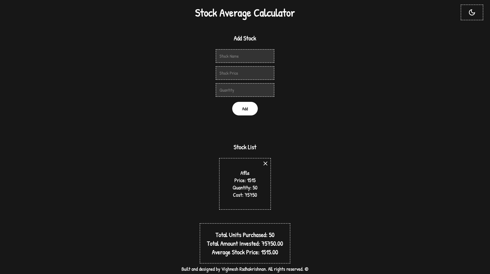
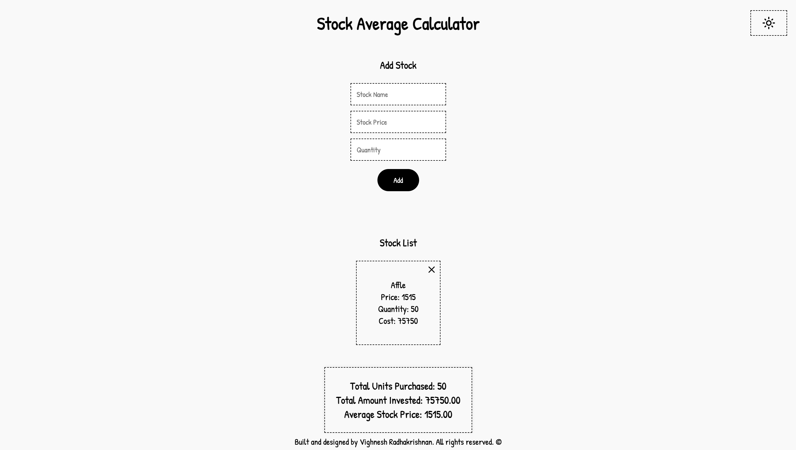

# Stock Average Calculator

## Overview

The Stock Average Calculator is a simple React-based web application that allows users to calculate the average price of stocks. Users can input stock names, prices, and their corresponding quantities, and the app will compute the average price of the stocks added. Additionally, users can edit individual stock details (name, price, and quantity) or delete their purchases as needed.
Use **[Stock Average Calculator](https://vikkujonsnow.github.io/stock-average-calculator/)**.

## Features

- Add stock prices and quantities.
- View a list of all added stocks.
- Automatically calculate and display the average stock price.
- Edit and Delete stock details

## Screenshots

  
_(Screenshot of Stock Average Calculator (Dark Mode).)_
  
_(Screenshot of Stock Average Calculator (Light Mode).)_

## Installation

1. **Clone the repository**:
   ```bash
   git clone https://github.com/your-username/stock-average-calculator.git
   cd stock-average-calculator
   ```
